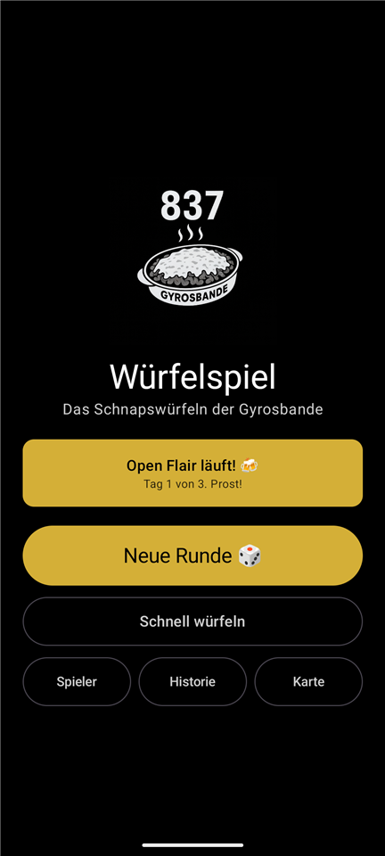
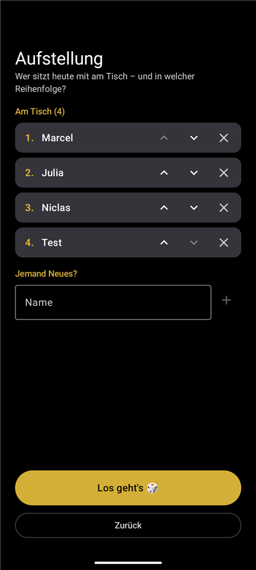
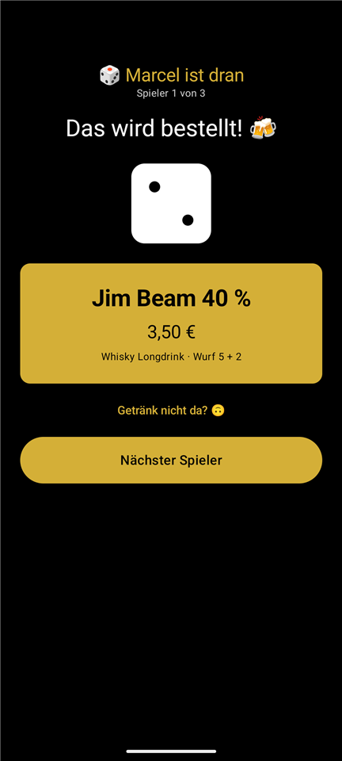
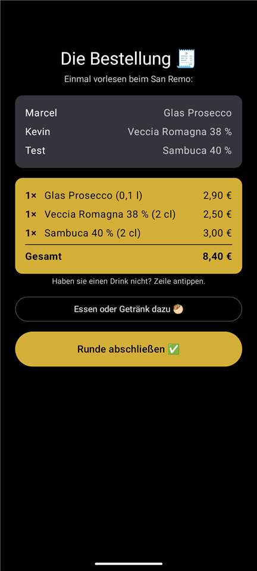
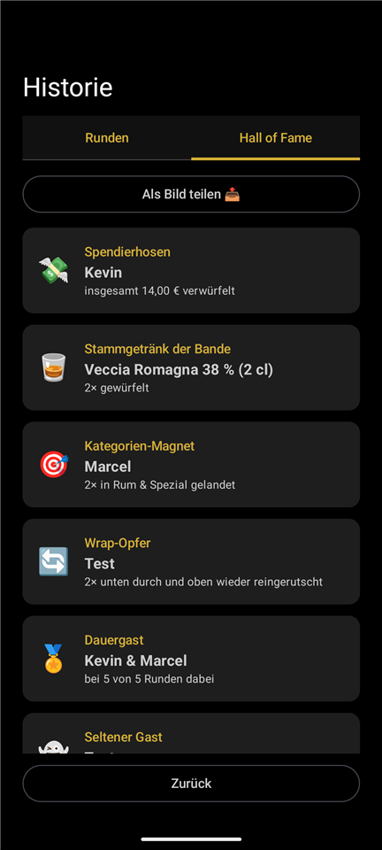

# 🎲 837 Dice - the Gyrosbande's drinking game app

The legendary schnapps dice game from the San Remo restaurant (Open Flair
festival, Eschwege) as an Android app. Roll 1 picks the category, roll 2
picks the drink - categories with more than 6 drinks use two dice, and if
you run off the bottom of the list you keep counting from the top. Can be a
whole bottle of Prosecco. Rules are rules. 🍾

[](../../actions/workflows/android.yml)
[](../../security/code-scanning)
[](../../releases/latest)
[](SECURITY.md)

## 📸 A round at the San Remo

| Home | Line-up | The roll |
|:---:|:---:|:---:|
|  |  |  |
| Counts down to the next Open Flair - and switches to "day X of Y" once it starts. | Who is at the table today, and in which order. Pre-filled with the last round. | Two rolls: category, then drink. Or shake the phone like a dice cup. |

| The order | Hall of Fame |
|:---:|:---:|
|  |  |
| Grouped and totalled, ready to read out to the waiter. Tap a line if they are out of it. | Who spends the most, who keeps landing in the same category, who is always there. |

## 📲 Download the app

- **Recommended:** grab the latest version from
  [Releases](../../releases/latest) - download the `.apk`, open it on your
  phone, allow installation from unknown sources, done. No GitHub account
  needed.
- **Every commit:** each build under [Actions](../../actions) has an
  artifact `837-dice-apk` (requires GitHub login, kept for 90 days).
- **Pixel Watch:** releases also contain a standalone watch app
  (`837-dice-wear-…apk`) - roll by tapping or shaking your wrist.
  Sideload it onto the watch with `adb install` (enable developer mode
  and wireless debugging on the watch first); details in
  [docs/WEAR.md](docs/WEAR.md).

## 🚀 Publish a new version

Just tag and push - no file to edit, no version to bump by hand:

```bash
git tag v1.5
git push origin v1.5
```

The tag itself **is** the version: CI reads it and sets `versionName`
(`"1.5"`) and a matching `versionCode` when it builds the release APK (see
the comment above `defaultConfig` in `app/build.gradle.kts`). Tags must
look like `vX.Y` or `vX.Y.Z` for this to work.

The pipeline builds, tests and attaches the APK to a GitHub release.
Release notes are generated automatically from the
[Conventional Commit](https://www.conventionalcommits.org) messages with
[git-cliff](https://git-cliff.org) (config: `cliff.toml`), so users can
see what changed between versions - see [CHANGELOG.md](CHANGELOG.md) for
the full history. After the release, CI also regenerates `CHANGELOG.md`
and pushes it to `main` as a bot commit - run `git pull` afterwards to
get it locally.

Signing is covered in [docs/SIGNING.md](docs/SIGNING.md).

## 🛠️ Build locally

### In Android Studio

1. **File → Open**, select this folder. Android Studio detects the Gradle
   project and syncs it automatically (first sync downloads dependencies -
   takes a few minutes).
2. Pick a run target in the toolbar (an emulator or a USB-connected phone
   with developer mode / USB debugging enabled).
3. Press **Run ▶** (or Shift+F10) to build, install and launch the debug
   build in one step.
4. To build a version to hand out without running it: **Build → Build
   Bundle(s) / APK(s) → Build APK(s)**. Click **locate** in the
   notification that appears when it finishes, or find it under
   `app/build/outputs/apk/debug/app-debug.apk`.
5. To build a **release APK signed with your own keystore** (skip this for
   just trying the app - the debug build above is enough): **Build →
   Generate Signed Bundle / APK…** → APK → point it at your keystore (see
   [docs/SIGNING.md](docs/SIGNING.md)) → choose the `release` build
   variant.
6. Version numbers are derived automatically from the git tag at CI build
   time (see "Publish a new version" above) - local builds always show
   `0.0-dev`. To build locally with a specific version, set `RELEASE_TAG`
   before invoking Gradle, e.g.
   `$env:RELEASE_TAG = 'v1.5'; .\gradlew.bat assembleRelease`.

### From the command line

```powershell
$env:JAVA_HOME = 'C:\Program Files\Android\Android Studio\jbr'
.\gradlew.bat test assembleDebug
```

The debug APK lands in `app/build/outputs/apk/debug/app-debug.apk`.

## 🔐 What's in the app

Every build lists its own ingredients and gets checked against known
vulnerabilities:

- **SBOM** (CycloneDX): attached to each [release](../../releases/latest)
  as `*-sbom.cdx.json`, and available as the `sbom` artifact on every CI
  run - so "which libraries were in this build?" stays answerable later.
- **CVE scan**: Trivy checks that SBOM on every run; findings land under
  [Security → Code scanning](../../security/code-scanning) and in the run's
  job summary.
- **Dependencies**: Dependabot proposes grouped updates weekly (including
  the Gradle wrapper), and GitHub's dependency graph covers indirect
  dependencies too.

Details and how to report something: [SECURITY.md](SECURITY.md).

## 📚 More

- [Game rules, menu & architecture](docs/DETAILS.md)
- [Signing & release secrets](docs/SIGNING.md)
- [Pixel Watch companion](docs/WEAR.md)
- [Roadmap: iPhone, Pixel Watch, Apple Watch](docs/MULTIPLATFORM.md)
